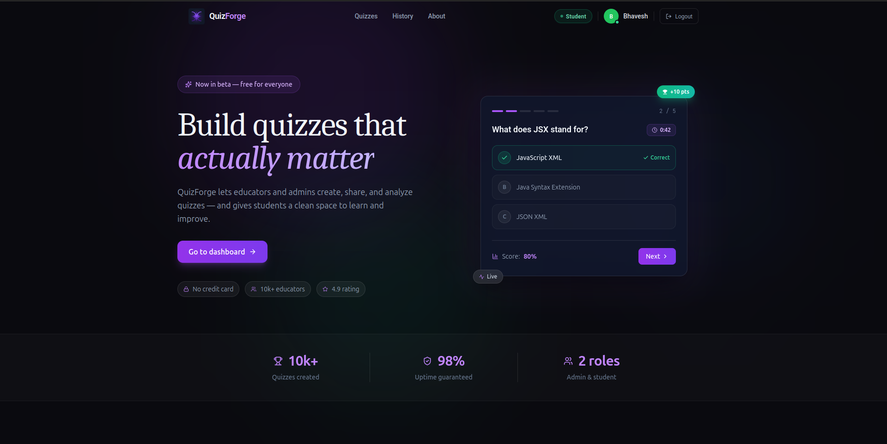
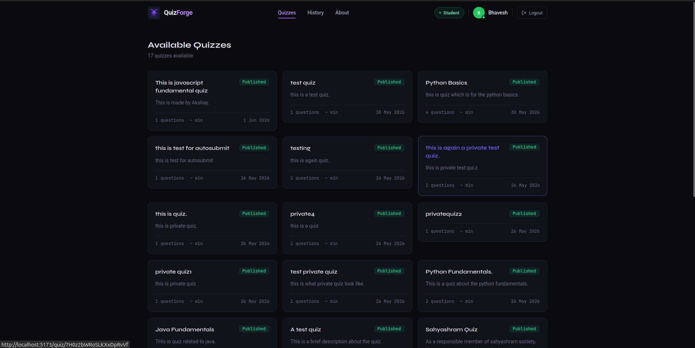
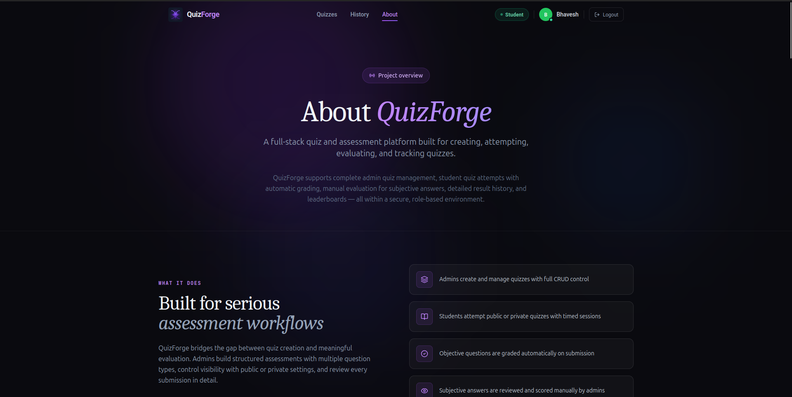
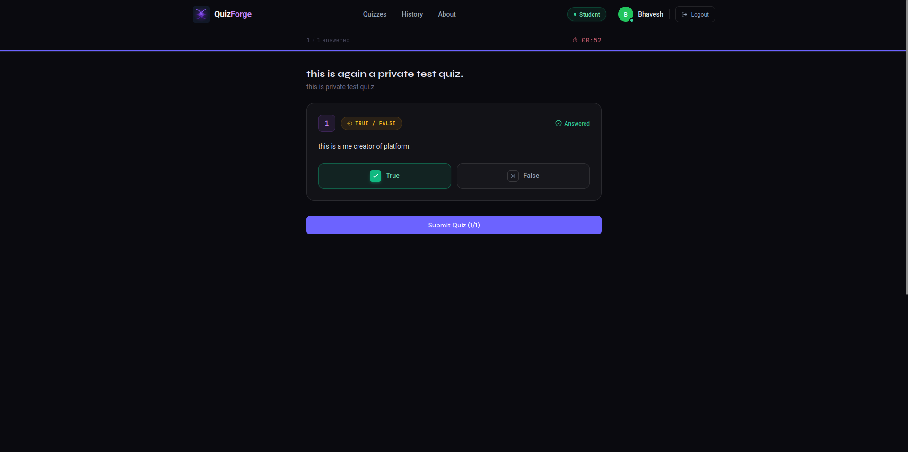
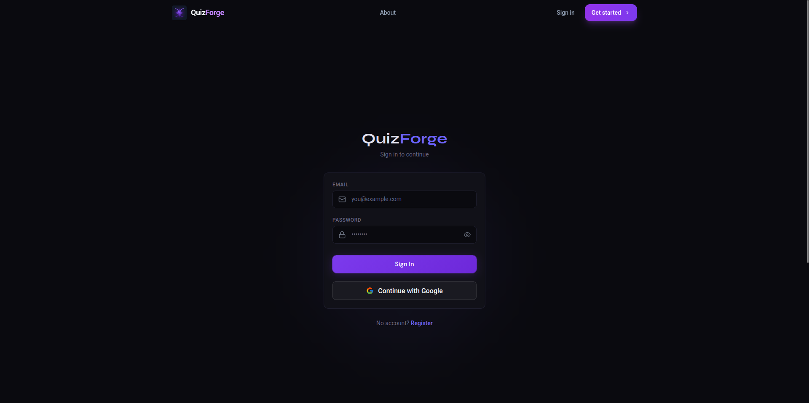
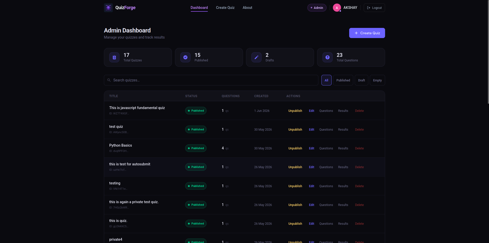
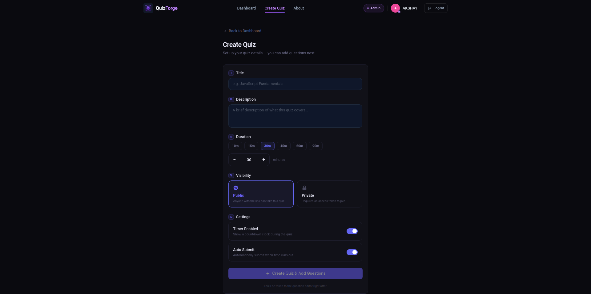
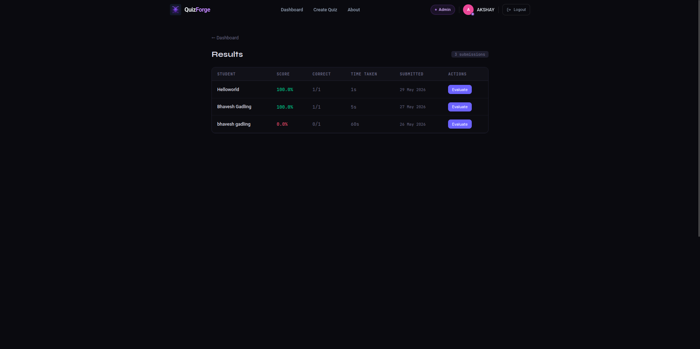
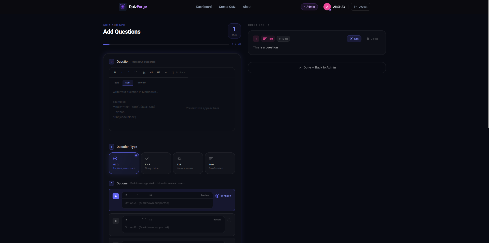

# QuizForge

QuizForge is a full-stack quiz and assessment platform for creating, attempting, evaluating, and tracking quizzes. It supports student and admin workflows, public and private quizzes, timed attempts, automatic grading, manual subjective evaluation, result history, and leaderboards.

## Highlights

- Student and admin roles with protected routes.
- Email/password authentication with bcrypt password hashing.
- Google OAuth through Firebase Authentication.
- JWT sessions stored in the HTTP-only `quizforge_token` backend cookie.
- Session rehydration on refresh through a protected backend endpoint.
- Admin quiz CRUD with publish and unpublish controls.
- Public quizzes and private quizzes with encrypted access tokens.
- Question types: MCQ, true/false, short integer, and short subjective.
- Backend timer validation for submitted quiz attempts.
- Automatic grading for objective questions.
- Manual admin evaluation for subjective answers.
- Result pages with question breakdowns and Markdown-rendered question text.
- Student history, stats, and quiz leaderboards.
- Firebase Firestore as the database.

## Tech Stack

Frontend:

- React 18
- Vite
- React Router
- React Query
- Tailwind CSS
- Axios
- Firebase client SDK
- React Markdown, Remark GFM, and Rehype Highlight

Backend:

- Node.js
- Express 5
- Firebase Firestore
- Firebase Admin SDK
- JSON Web Tokens
- bcrypt
- Node crypto for AES-256-CBC private quiz token encryption

## Project Structure

```txt
QuizForge/
  backend/
    config/
    constants/
    controllers/
    middlewares/
    routes/
    services/
    utils/
    server.js
  frontend/
    src/
      components/
      context/
      hooks/
      pages/
      routes/
      services/
      utils/
```

## Screenshots











## Workflows

Workflow diagrams and notes are available in [WORKFLOW.md](./WORKFLOW.md).

The current documented flows cover:

- Overall application flow
- Student quiz flow
- Admin quiz management flow
- Result evaluation flow
- Backend auth and authorization flow

## Authentication And Sessions

QuizForge supports email/password auth and Google OAuth.

Email/password:

1. User registers with name, email, password, and role.
2. Backend hashes the password with bcrypt.
3. Backend stores the user in Firestore.
4. Backend issues a JWT and sets `quizforge_token` as an HTTP-only cookie.

Google OAuth:

1. Frontend opens the Firebase Google popup.
2. Firebase returns a Google ID token.
3. Frontend sends the ID token to `POST /api/auth/google`.
4. Backend verifies the ID token with Firebase Admin.
5. Backend finds or creates the app user in Firestore.
6. Backend issues the app JWT and sets `quizforge_token`.

Session rehydration:

1. On app load, the frontend calls `POST /api/`.
2. The browser automatically sends `quizforge_token` when credentials and cookie settings allow it.
3. `authenticateToken` verifies the JWT and attaches the user to `req.user`.
4. The backend returns the authenticated user.
5. The frontend restores `AuthContext`.

Role behavior:

- Student routes require an authenticated user with role `student`.
- Admin routes require an authenticated user with role `admin`.
- Admin APIs pass through role authorization middleware.
- In production, public self-registration as `admin` is risky. A safer setup is to register users as `student` by default and promote admins manually or through an invite/admin code.

## Quiz And Result Flow

Admins can:

- Create quizzes with title, description, duration, visibility, and access token when private.
- Add MCQ, true/false, short integer, and short subjective questions.
- Publish or unpublish quizzes.
- Edit or delete quizzes and questions.
- Review and evaluate subjective answers.
- View quiz submissions and final results.

Students can:

- Browse active quizzes.
- Attempt public quizzes directly.
- Enter an access token for private quizzes.
- Complete timed attempts.
- View result breakdowns.
- Check leaderboards, history, and stats.

Result behavior:

- MCQ and true/false answers are checked by selected option index.
- Short integer answers are normalized and compared numerically.
- Short subjective answers are marked pending for admin evaluation.
- Result records include answer data and question snapshots so result pages can display the original question context later.

## Firebase Setup

Create a Firebase project and enable:

- Firestore Database
- Authentication
- Google sign-in provider

### Enable Google Provider

1. Open Firebase Console.
2. Go to Authentication -> Sign-in method.
3. Enable Google.
4. Add a support email.
5. Save.

### Authorized Domains

In Firebase Console:

1. Go to Authentication -> Settings -> Authorized domains.
2. Add local and deployed frontend domains.

For local development:

```txt
localhost
```

For Vercel production, add the exact Vercel domain without `https://`:

```txt
your-project.vercel.app
```

If you later use a custom domain, add that too:

```txt
example.com
www.example.com
```

Firebase authorized domains do not generally cover every random Vercel preview URL automatically. Add preview domains manually if OAuth should work there.

## Environment Variables

Create environment files from the provided samples:

```bash
cp backend/.env.sample backend/.env
cp frontend/.env.sample frontend/.env
```

### Backend

```env
FIREBASE_API_KEY=
FIREBASE_AUTH_DOMAIN=
FIREBASE_PROJECT_ID=
FIREBASE_STORAGE_BUCKET=
FIREBASE_MESSAGING_SENDER_ID=
FIREBASE_APP_ID=
FIREBASE_MEASUREMENT_ID=

ACCESS_TOKEN_SECRET=
REFRESH_TOKEN_SECRET=
PORT=5000

COLLECTION_USERS=users
COLLECTION_QUIZZES=quizzes
COLLECTION_QUESTIONS=questions
COLLECTION_RESULTS=results

NODE_ENV=development
ENCRYPTION_KEY=

FRONTEND_LOCAL_URL=http://localhost:5173
FRONTEND_URL=
```

Notes:

- `ACCESS_TOKEN_SECRET` should be a strong random string.
- `ENCRYPTION_KEY` must be a 32-byte hex key for AES-256-CBC, which means 64 hex characters.
- In production, set `NODE_ENV=production`.
- In production, set `FRONTEND_URL` to the deployed frontend origin, for example `https://your-project.vercel.app`.

Generate an encryption key:

```bash
node -e "console.log(require('crypto').randomBytes(32).toString('hex'))"
```

### Frontend

```env
VITE_API_BASE=http://localhost:5000/api

VITE_FIREBASE_API_KEY=
VITE_FIREBASE_AUTH_DOMAIN=
VITE_FIREBASE_PROJECT_ID=
VITE_FIREBASE_STORAGE_BUCKET=
VITE_FIREBASE_MESSAGING_SENDER_ID=
VITE_FIREBASE_APP_ID=
VITE_FIREBASE_MEASUREMENT_ID=
```

For production:

```env
VITE_API_BASE=https://your-backend-domain.com/api
```

The `VITE_FIREBASE_*` values come from Firebase Console -> Project settings -> Your apps -> Web app config.

## Local Development

Install dependencies separately:

```bash
cd backend
npm install
```

```bash
cd ../frontend
npm install
```

Start the backend:

```bash
cd backend
npm start
```

Start the frontend in another terminal:

```bash
cd frontend
npm run dev
```

Default local URLs:

- Frontend: `http://localhost:5173`
- Backend: usually `http://localhost:5000`
- API base: `http://localhost:5000/api`

## Available Scripts

Backend:

```bash
npm start
```

Starts Express with Node's `--env-file=.env` and watch mode.

```bash
npm run dev
```

Starts Express without `--env-file`. Use this only when your shell already has the required environment variables loaded.

Frontend:

```bash
npm run dev
npm run build
npm run preview
npm run lint
```

Note: the current frontend lint script uses the legacy `--ext` flag with `eslint.config.js`. If linting fails locally, update the script/config or run the compatible ESLint command for your installed version.

## Main API Routes

Auth:

- `POST /api/auth/register`
- `POST /api/auth/login`
- `POST /api/auth/logout`
- `POST /api/auth/google`

Student:

- `POST /api/`
- `GET /api/quizzes`
- `GET /api/quizzes/:quizId/attempt`
- `POST /api/quizzes/:quizId/start`
- `POST /api/quizzes/:quizId/submit`
- `GET /api/quizzes/:quizId/result`
- `GET /api/quizzes/:quizId/leaderboard`
- `GET /api/student/attempt-history`
- `GET /api/student/history-paginated`
- `GET /api/student/stats`

Admin:

- `GET /api/admin/quizzes`
- `POST /api/admin/quizzes`
- `GET /api/admin/quizzes/:quizId`
- `PUT /api/admin/quizzes/:quizId`
- `DELETE /api/admin/quizzes/:quizId`
- `POST /api/admin/quizzes/:quizId/publish`
- `POST /api/admin/quizzes/:quizId/unpublish`
- `GET /api/admin/quizzes/:quizId/questions`
- `POST /api/admin/quizzes/:quizId/questions`
- `PUT /api/admin/quizzes/:quizId/questions/:questionId`
- `DELETE /api/admin/quizzes/:quizId/questions/:questionId`
- `GET /api/admin/quizzes/pending`
- `GET /api/admin/quizzes/:quizId/pending-results`
- `POST /api/admin/results/:resultId/evaluate`
- `GET /api/admin/quizzes/:quizId/results`
- `GET /api/admin/quizzes/:quizId/results/:userId`

## Deployment Notes

Frontend on Vercel:

1. Set the project root to `frontend`.
2. Build command: `npm run build`.
3. Output directory: `dist`.
4. Add all `VITE_*` environment variables.
5. Add the Vercel domain to Firebase Authorized domains.

Backend:

Deploy the `backend` folder to a Node-capable host such as Render, Railway, Fly.io, or a VPS.

Production requirements:

- Set all backend environment variables on the host.
- Set `NODE_ENV=production`.
- Set `FRONTEND_URL` to the deployed frontend origin.
- Set frontend `VITE_API_BASE` to the deployed backend API URL.
- Serve the backend over HTTPS so `secure` cookies work.

Cookie and CORS behavior:

- In production, `quizforge_token` uses `httpOnly: true`, `secure: true`, and `sameSite: "None"`.
- Axios uses `withCredentials: true`.
- Backend CORS allows credentials and uses `FRONTEND_URL` as the production origin.
- `FRONTEND_URL` must exactly match the deployed frontend origin.

## Contributing

See [CONTRIBUTING.md](./CONTRIBUTING.md) for setup, branch, code style, testing, and pull request guidance.

## License

This project is licensed under the terms in [LICENSE](./LICENSE).
