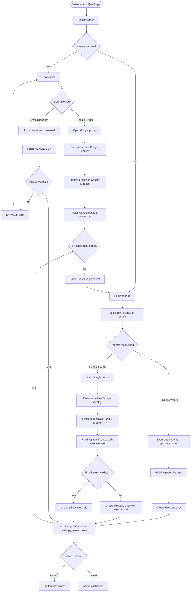
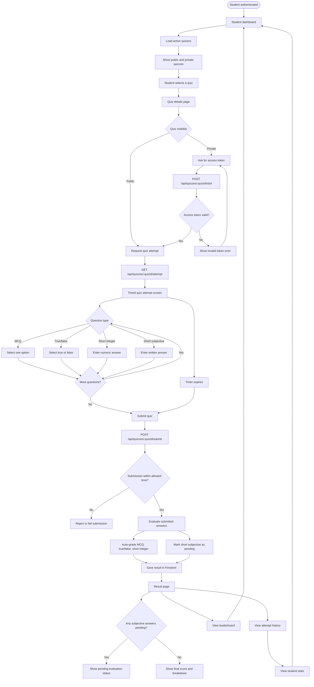
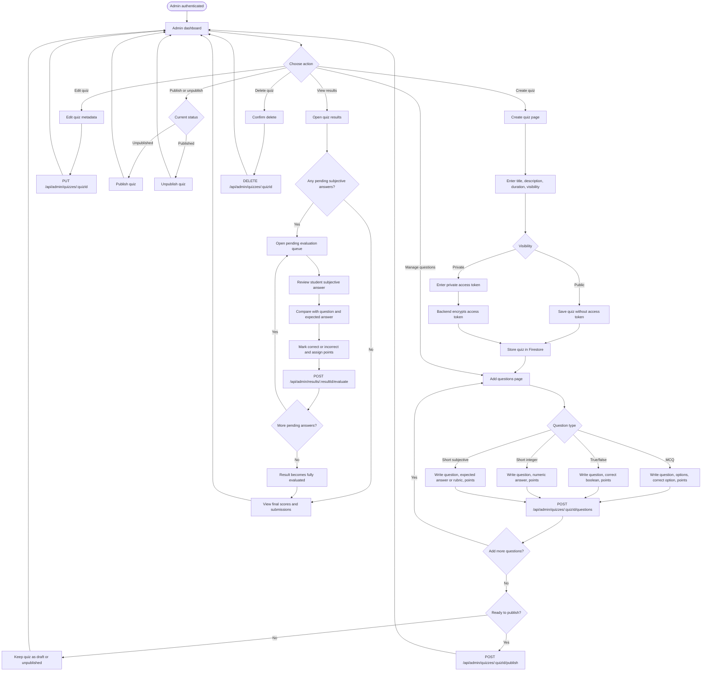
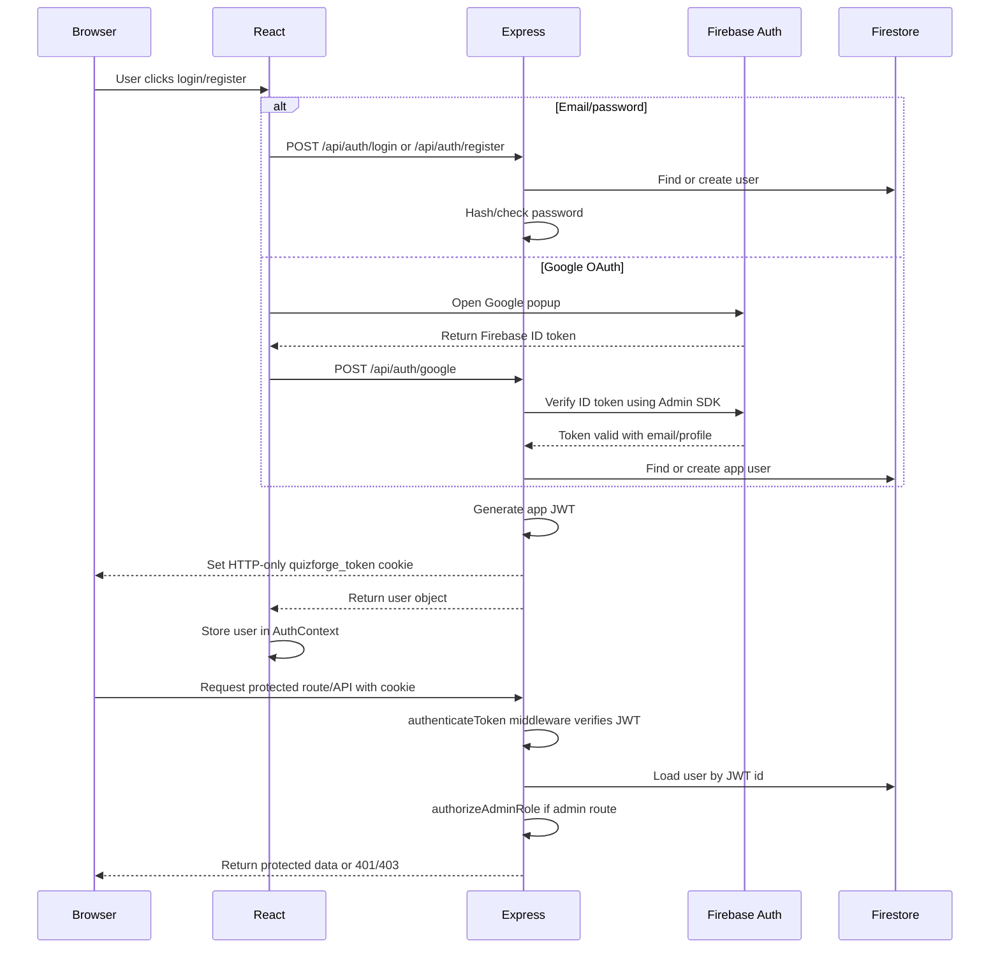
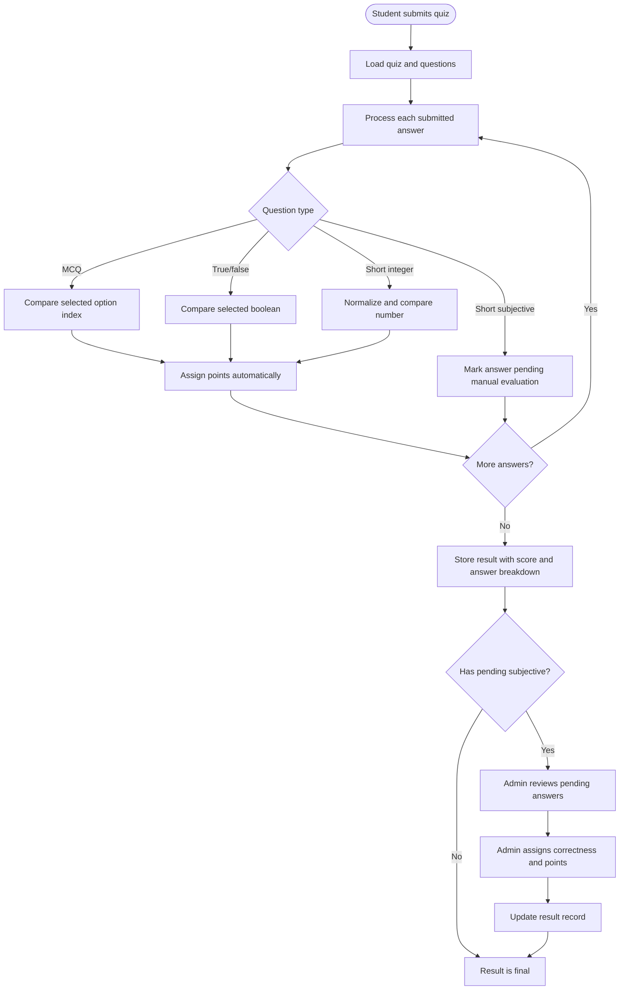

# QuizForge Workflow Diagrams

This document describes the current user and admin workflows in QuizForge. The diagrams use Mermaid, so they render directly on GitHub and in many Markdown viewers.

## Overall Application Flow

## Student Workflow

### Student Flow Notes

- Students can only access student routes after authentication.
- Public quizzes can be attempted directly.
- Private quizzes require an access token before questions are released.
- Objective question types are graded automatically.
- Short subjective answers remain pending until an admin evaluates them.
- Student history and stats are computed from saved result records.

## Admin Workflow

### Admin Flow Notes

- Admin routes are protected by authentication and role authorization middleware.
- Private quiz access tokens are encrypted before storage.
- Admins can create, update, delete, publish, and unpublish quizzes.
- Admins can manage questions independently from quiz metadata.
- Objective questions are auto-graded during student submission.
- Subjective answers require manual evaluation before results are final.

## Backend Auth And Authorization Flow

## Result Evaluation Flow

