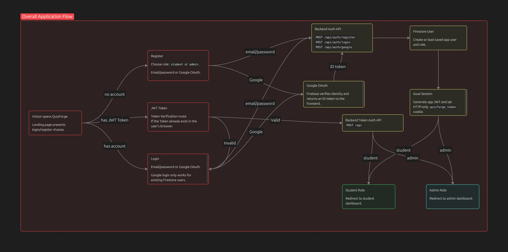
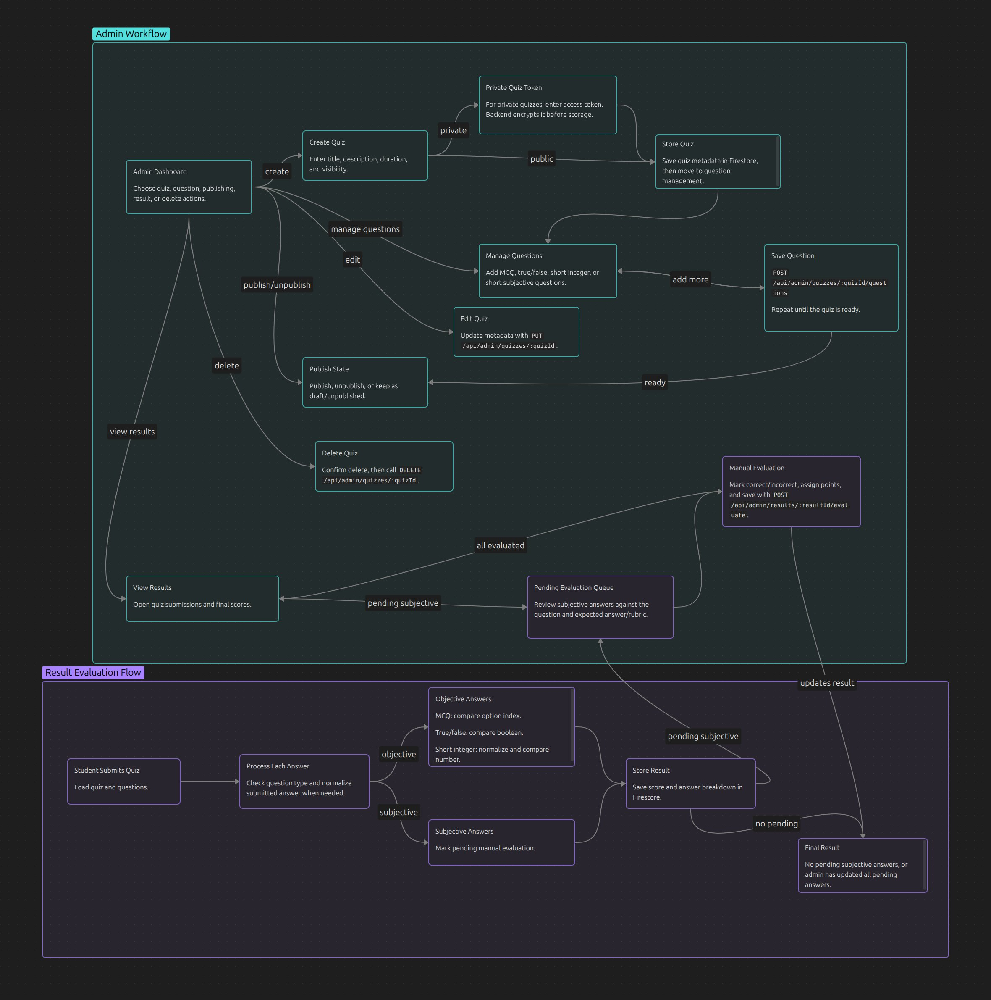
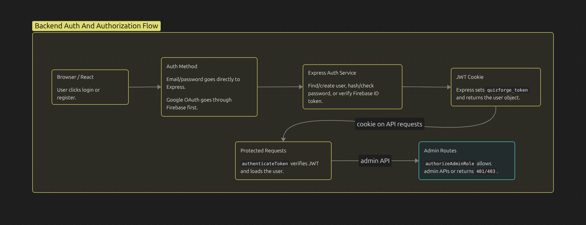

# QuizForge Workflow Diagrams

This document describes the current user and admin workflows in QuizForge. The diagrams are build into Obsidian canvas but i converted that to jpg so that it should rendered as images.
I am also attaching the obsidian Canvas code as it's not rendered in Github By default.
[!Obsidian Canvas](/images/QuizForge.workflow.canvas)

## Overall Application Flow

### Student Flow Notes

- Students can only access student routes after authentication.
- Public quizzes can be attempted directly.
- Private quizzes require an access token before questions are released.
- Objective question types are graded automatically.
- Short subjective answers remain pending until an admin evaluates them.
- Student history and stats are computed from saved result records.

## Admin Workflow and Result workflow.

### Admin Flow Notes

- Admin routes are protected by authentication and role authorization middleware.
- Private quiz access tokens are encrypted before storage.
- Admins can create, update, delete, publish, and unpublish quizzes.
- Admins can manage questions independently from quiz metadata.
- Objective questions are auto-graded during student submission.
- Subjective answers require manual evaluation before results are final.

### Result Flow Notes

- Student submissions are stored as result records in Firestore.
- Each result stores the quiz id, student id, score, total points, time taken, answer list, and evaluation status.
- Objective answers are evaluated immediately during submission.
- MCQ and true/false questions compare the selected option index with the saved correct option index.
- Short integer questions normalize the submitted value and compare it with the saved correct answer.
- Short subjective answers are marked pending and wait for admin review.
- Each saved answer includes a question snapshot so result pages can still show the original question text, options, correct answer, and points later.
- The student result page reads the detailed result and renders the question breakdown with Markdown formatting.
- Results with pending subjective answers show an evaluation pending state until the admin finishes grading.
- Admin evaluation updates pending subjective answers, recalculates the result, and makes the final score available.
- Leaderboards and student history are computed from saved result records.

## Backend Auth And Authorization Flow

### Backend Auth Flow Notes

- The backend is the source of truth for authentication.
- After email/password login, register, or Google OAuth, the backend issues an app JWT.
- The JWT is stored in the browser as the `quizforge_token` HTTP-only cookie.
- Because the cookie is HTTP-only, frontend JavaScript cannot read the JWT directly.
- On app reload, the frontend calls the protected `POST /api/` session endpoint.
- The browser automatically sends `quizforge_token` with that request when cookie and CORS settings allow credentials.
- The `authenticateToken` middleware reads `req.cookies.quizforge_token`, verifies the JWT, and attaches the decoded user to `req.user`.
- If the token is valid, the backend returns the authenticated user and the frontend restores `AuthContext`.
- If the token is missing, expired, or invalid, the backend returns `401` and the frontend keeps the user logged out.
- Admin-only APIs also pass through `authorizeAdminRole`, which returns `403` when the user is authenticated but does not have the `admin` role.
- Logout calls the backend logout route, which clears the `quizforge_token` cookie.
